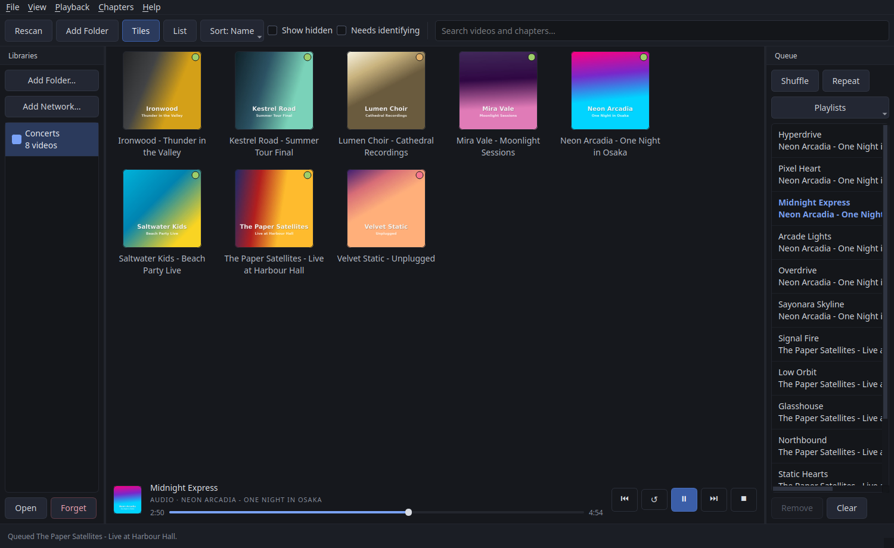

# Media Chapter Browser

I made this for myself, because I have a large collection of blu ray concerts
that I've ripped onto my NAS.
I also have some as MKVs that have no chapters at all, just one long video.
And of course the problem with that, is finding the song you want, in the 
concert you want, is annoying.

This app uses several methods to find the chapter times and names and let you
easily listen to or watch the exact songs you want, create playlists, etc.

Your media files are never modified; the names live in
this app's own data directory.

It uses things like checking the blu ray menu and using AI to OCR the chapter
names and match them to the times. In the case of single files with chapters
but no titles, it can search MusicBrainz to get the titles and match them.

In the case of single files with no chapters and no titles, it can use AI,
MusicBrainz and web searches, as well as audio and visual scans and screenshots
of the video to determine chapter start and end times and then still work it out.

And there's a simple interface to correct any mistakes by hand, most commonly
the start of a song being a few seconds off in tracks entirely worked out
using AI tools.

> [!WARNING]
> **This is beta software, provided as is, with no warranty or guarantee of
> any kind** (see the [licence](LICENSE)). It only ever reads your media
> files, but back up anything you can't afford to lose all the same.
>
> **The AI features cost real money, and it can add up.** They're optional
> and off until you give the app an API key, and each one says roughly what
> it costs before it runs - but a large library identified with the AI is
> many requests. Use an API key with a spending limit: Nano-GPT lets you set
> a **USD per day** cap on each key in its dashboard, and since its credit
> is prepaid, keeping only a small balance on the account caps it too.



<sub>The library shown is made up: fictional bands, generated covers.</sub>


## Requirements

External programs, installed with your package manager:

| | |
|---|---|
| `ffmpeg` / `ffprobe` | reading chapters and cover art |
| `mpv` | playback |
| `libbluray` | Blu-ray disc folders (optional) |

```
# Debian/Ubuntu
sudo apt install ffmpeg mpv libbluray-bin
# Arch/CachyOS
sudo pacman -S ffmpeg mpv libbluray
```

The app checks for these at startup and tells you what is missing.

## Install and run

### AppImage

A single file, nothing to install. Download it from the
[Releases](https://github.com/DigitalArchon/MediaChapterBrowser/releases) page, or build
it from a clone:

```
git clone https://github.com/DigitalArchon/MediaChapterBrowser.git && cd MediaChapterBrowser
bash packaging/appimage/build.sh     # -> dist/MediaChapterBrowser-<version>-x86_64.AppImage
chmod +x dist/MediaChapterBrowser-*.AppImage
./dist/MediaChapterBrowser-*.AppImage
```

The build is reproducible: a given commit always makes the same AppImage,
byte for byte, whoever builds it and wherever. Each release's `.sha256`
can be checked against your own build of its tag:

```
bash packaging/appimage/verify-reproducible.sh v0.12.0   # builds it twice, compares
```

It carries its own Python and Qt, and runs on Ubuntu 22.04 / Debian 12 /
Fedora 35 / RHEL 9 and newer (glibc 2.34+). It does **not** carry ffmpeg, mpv
or libbluray — those come from your distribution, for the reason in the
table above: mpv has to reach your machine's own audio server, GPU and
display, and a copy shipped in here would be the wrong one.

It uses your system's CA certificates for the things it fetches over
HTTPS (MusicBrainz lookups, cover art, and the AI through Nano-GPT), rather
than carrying its own bundle — so your machine's trust decisions apply, and
the certificates stay current with your package manager. `SSL_CERT_FILE` / `SSL_CERT_DIR` override
the search if you need them to.

To put it in your desktop menu:

```
mkdir -p ~/.local/share/applications ~/.local/share/icons/hicolor/scalable/apps
cp packaging/mediabrowser.svg ~/.local/share/icons/hicolor/scalable/apps/
sed "s|^Exec=.*|Exec=$PWD/dist/$(cd dist && ls MediaChapterBrowser-*.AppImage)|; \
     /^#/d; \$aIcon=mediabrowser" mediabrowser.desktop \
  > ~/.local/share/applications/mediabrowser.desktop
update-desktop-database ~/.local/share/applications 2>/dev/null || true
```

### From source

The window is built with Qt (PySide6), which is a Python package, so it
lives in a virtualenv rather than being installed system-wide:

```
python3 -m venv .venv
.venv/bin/pip install -e ".[dev]"
.venv/bin/mediabrowser
```

`.venv/bin/python main.py` does the same thing. `--library <folder>` opens a
particular folder on start.

## Using it

**Add a folder** scans it for videos and Blu-ray disc folders. Everything it
finds appears on the shelf; click a cover to see that video's chapters.

**Several libraries at once.** Tick libraries in the *Libraries* panel
to have them on the shelf together — searched, sorted, queued and
identified as one, each video still stored in (and locked, private or
hidden by) its own library. Double-click one, or **Open**, to see it
alone. **Rescan** rescans every library on show, and the next start shows
the same ones again.

**Network folders.** **Add Network Folder** lists the shares your file
manager is connected to or has bookmarked (or takes an address like
`smb://nas/media/Concerts`), connects if needed, and lets you pick the folder
to use. The app needs the share presented as an ordinary folder, which is
your desktop's job: **gvfs-fuse** on Cinnamon, GNOME, MATE and Xfce, or
**kio-fuse** on KDE — if neither is installed, it says which to install.
The address is kept with the library, so rescanning after the share has
dropped reconnects it first. For a big library on a NAS, a kernel mount
(`cifs` in `/etc/fstab`) is faster than either bridge; add it with plain
Add Folder.

**Scanning** shows a **Cancel** button in the status bar (also **File →
Cancel Scan**) — for the time you picked a whole drive by mistake. A
cancelled scan changes nothing.

**Tiles or list.** The shelf shows either covers (`Ctrl+1`) or a list
(`Ctrl+2`). Titles are shown in full in both — tiles grow to fit the longest
one rather than cutting it off.

**Hiding.** A big folder tree often has things you never want on the
shelf — trailers, extras, a folder of test rips. Right-click any video in it
and **Hide Folder**; for a video several folders deep you can pick which
level to hide. **Hide This Video** (or **Hide This Title** on a Blu-ray)
hides just the one — for a disc whose extras sit beside the concert, where
hiding the disc's folder would take the concert too. Hidden videos are left out of the shelf and of searches, and
the status bar counts them. Tick **Show hidden** to see them again (dimmed),
play them, or right-click to **Unhide**. Nothing is deleted or rescanned
differently — it only changes what the shelf shows. **Open Containing
Folder** on the same menu shows the video in your file manager.

**What each video is.** The list's *Type* column says what a video is
underneath, whatever chapters it has been given since: a **Blu-ray** title,
a **File with chapters** of its own, or a **File, no chapters** — which
it stays even after you add some. (A library from before this was
recorded shows plain *File* for a video whose chapters the app made, until
the next rescan reads the file once to find out.)

**Identify from the shelf.** Right-click any video and **Identify** works
out its chapters and names in the background, without opening it — the
same way Identify Library is set to (which methods, and whether the AI
may be used). The status bar says what it found, and **Undo Last
Identification** puts it back.

**Locked and private.** Right-click a video, or a library in the
*Libraries* panel, to set either:

- **Locked** — nothing changes it: no renaming, no chapter edits by hand,
  nothing from Identify, and a rescan keeps it exactly as stored, even
  when its file has changed or gone. It still plays and queues.
- **Private** — yours to change as you like, and the local tools work
  (detecting chapters from the audio, pasting a tracklist, Manual Edit),
  but nothing about it is ever sent to MusicBrainz or the AI.

Set on a library, either holds for every video in it, whatever a video's
own setting says. The list's *Protection* column shows which apply, with
"(library)" when it's the whole library's.

**What still needs identifying.** The list's *Identified* column, and a
dot on each cover, say how far along a video is: green when every
chapter has a real name, amber when some do, red when none do — or when
a long video has never been split into songs. Names like "Chapter 01" or
"(01)00:00:00:000", which authoring tools write when nobody named
anything, don't count. Tick **Needs identifying** to see only those;
the status bar says how many there are, and *Sort: Least named* puts
them first.

**Single songs.** A video file in one piece that runs under 11 minutes —
a music video, a festival clip — is named after its file to begin with,
without its track number or `[4K 50fps]`-style tags, so a search finds
it. That name is only provisional, and shows as **Unverified** (amber)
until it's been checked: **Mark Name as Checked** on the chapter's menu
(or renaming it) says it's right, and Identify Library checks it itself
— against MusicBrainz's recordings for free (the video's artist, a
title its file's name contains, about its length), and with the AI if
you allow it. Renaming the video renames its chapter along with it.
Longer videos in one piece are *Not split*, and are named the same way.

**Blu-ray extras.** Every title on a disc 20 seconds or longer is listed
— trailers, behind-the-scenes films and the like, not just the concert —
while a disc's second copy of the same video (the feature again without
its chapters, say) is left out. **Rename…** on any video's right-click
menu gives an extra a proper name ("Title 5" becomes "Behind the
Scenes"), kept across rescans; an empty name goes back to the scanned
one. **Hide This Title** takes away any you don't want.

**Searching** matches video names and chapter names. It switches to the list
and puts the chapters that matched underneath their video, so a song you can
only half-remember the home of is one double-click from playing — no need to
open each disc to look. Clearing the search puts back whichever view you were
using.

**Detect Chapters.** Rename a chapter at a time, or open **Detect
Chapters** to do a whole video at once.

**Just Figure It Out**, at the top, does the whole job for you: it reads
the disc's menu if there is one, looks the show up on MusicBrainz,
measures the audio and has the AI look at the video — as many of those as
this video turns out to need, the most accurate first. It uses the AI (a
few cents), shows everything it found and where each name came from, and
changes nothing until Apply.

Or do it a step at a time, from the easiest to the hardest:

0. **Extract Disc Menu** — for a Blu-ray title, this tab (the one it
   opens on) is the best source there is: the disc's own
   scene-selection menu, its makers' list of the songs. The app decodes
   the menu from the disc itself, works out exactly which chapter each
   button plays by running the disc's navigation commands in a sandbox,
   draws each button highlighted as a player would, and has the AI read
   the text off it — so the names are the disc's, on the chapters the
   disc puts them on, with nothing matched or guessed. Chapters no
   button plays (the story films between songs, an encore break, the
   credits) are named by the AI's judgement and marked as such. It
   needs a Nano-GPT key for the reading, costs a cent or two with
   Sonnet, and takes about half a minute. Discs whose menus are written
   in Java (BD-J) can't be read this way yet, and a rip to a single file
   has left its menus behind — for a file the tab is switched off and
   says *Blu-ray only*.
1. **Tracklist** — one page, easiest first: look the show up on
   MusicBrainz; failing that, **Paste a Tracklist** from anywhere (a
   sleeve, setlist.fm; durations optional); failing that, neither — a
   video file's chapters are then found from the audio as soon as the
   dialog opens, and a tracklist given later takes over. The search opens
   pre-filled from the file and folder names and only runs when you press
   Search, since MusicBrainz rate-limits hard. For a box set, only the discs
   whose lengths add up to the video are ticked, so songs aren't taken from
   another night's show.
2. **It picks the best way to use it**, and says which — you can switch:
   - **Name the existing chapters**, when the video came with its own (a
     disc's chapters sit where its author put them). When the tracks are
     the whole video, each song is named on the chapter where its CD track
     plays; otherwise by matching durations, falling back to order (marked
     `*` — check those). The notes say which chapters start well off their
     track, and where a missing song should be split.
   - **Place chapters by the track lengths**, when the lengths cover the
     whole video: each song starts where the lengths before it add up to —
     within a second or two, as a live album's CDs are cut from the same
     master as its video. The audio then **splits each song's intro off**
     (a story video, an entrance, an intermission) as "Intro to …", with
     the song itself starting where the band does.
   - **Detect chapters from the audio**, when there are no lengths: it
     listens for the bass dropping out between songs, and checks the stage
     lighting around each quiet stretch (a quiet moment where the lights
     come *up* is a breakdown within a song). A tracklist of titles tells it
     how many songs to find and names them in order.

   The audio and lighting are only measured when needed — the audio starts
   in the background while you search — and once per session.
3. **Then ask the AI to look and check** (optional, see below). It sends
   the proposal, the tracklist and a few frames of the video to a model
   that can read the song's caption off the screen, recall the setlist,
   and give the titles as the songs are known in English (see below).
4. **Apply.** Nothing changes until then, and the whole proposal is shown
   first. Chapters the app made are stored in its library only, never
   written into the file. Starts found from the audio are marked `~` until
   you fix them.

**Asking the AI.** All of the matching above goes on times and text, and
gets things wrong: a chapter named for the song after it, a breakdown
taken for a gap, a title left in Japanese where nobody outside Japan
would search for it. A model that can *look* fixes most of that. **Ask AI**
in Detect Chapters sends it what the app knows — the file and folder
names, the chapter (or estimated) times, the tracklist if there is one,
where the audio thinks the songs stop — plus a frame or two from just
after each start, where a concert Blu-ray captions the song. It answers
with a name for every chapter, how sure it is (guesses are shown in
red), the original title where it romanised one, and, for estimated
chapters, corrected starts chosen from the measured candidates. It works
with a disc's own chapters (they stay put and get named), with chapters
placed by lengths or detected from the audio, and with no tracklist at
all. By default it also **looks the show up online** first (Nano-GPT runs
a web search for the model): on a rip whose frames show no captions,
that is the difference between guessing a plausible setlist and reading
the real one off setlist.fm — untick it for a show no site lists, or to
save a little. AI Settings picks who searches: Kagi (the default) or
Perplexity find the right page most reliably; LinkUp is Nano-GPT's own
and the only one allowed on an account with Zero Data Retention switched
on, so the app falls back to it, and says so, when the other is refused.

**List Models** in AI Settings shows only models that can look at
pictures, which everything here needs, with `anthropic/claude-sonnet-5`
(the default, and the one this app was tested with) and
`anthropic/claude-opus-5.5` first. Any other OpenAI-compatible service
and vision model can be used — set the endpoint and model — but web
search is Nano-GPT's own and is switched off elsewhere, and another
model may not read menus and video frames as well.

**Romanised titles.** The name a Japanese song goes by outside Japan is
rarely a translation of it: いいね! is released as "Iine!", not "So Good",
and メギツネ as "Megitsune". So wherever the AI names songs (the
*Romanised titles* box, on by default) it gives each title as the song is
officially released in English-language markets — a romanisation, or the
song's official English title where it has one — and never translates the
meaning. **Romanise Titles with AI** in the Chapters menu does just that
for names already there. A romanised chapter keeps its original title
underneath, so a search in either script finds the song (the dot beside
it is purple).

It runs through [Nano-GPT](https://nano-gpt.com), a pay-as-you-go
gateway to Claude and other models: make an account, add a few dollars,
paste an API key into **File → AI Settings** and pick a model
(`anthropic/claude-sonnet-5` is the default and reads captions fine;
Opus is more careful and several times the price). A concert's chapters
cost a few cents. The key lives in `settings.json` in plain text, or set
`NANOGPT_API_KEY` in the environment. Nothing is sent until you press Ask
AI, and nothing is applied until Apply.

**Manual Edit** (`Ctrl+Shift+K`, or the button under the chapter list)
is for doing it all by hand — no AI account needed, and the way to name
a video nothing else can. The video plays right in the main window, with
a timeline of its chapters beneath it and the chapters beside it:

- Get close, then exact: jump ten seconds, five or one (buttons, or
  ←/→ with Ctrl or Shift for the bigger steps), then a frame at a time
  (`,` and `.`). Page Up/Down go to the previous or next chapter; click
  the timeline to go anywhere.
- **Insert chapter here** (or `M`) starts a chapter at the playhead and
  puts you straight into its name; Enter goes back to moving through
  the video.
- Know the setlist? Paste it into *Names in order* first, and each
  chapter you insert takes the next name — or name the chapters in
  order afterwards.
- A chapter a little out is dragged along the timeline, moved to the
  playhead, or nudged a second; `Delete` removes one.

Nothing changes until **Save Chapters**. A chapter whose start and name
you left alone keeps where its name came from, and if you only renamed
chapters, a disc's or file's own chapters stay its own. The video is
drawn into the window on X11 — on a Wayland desktop the app runs under
XWayland for this (and so does mpv), unless `QT_QPA_PLATFORM` is set to
`wayland` alone, in which case it plays in mpv's own window, the editor
still drives it, and it says how to bring it in.

**Identify Library** (`Ctrl+I`, in the File menu) does all of that for
every video that still needs it, unattended — start it and walk away. You
choose which methods it may use:

| | |
|---|---|
| MusicBrainz tracklists | free; only used when a release's tracks add up to the video |
| Split videos in one piece where the music stops | free; the chapters still need names |
| Read Blu-ray menus | AI; the disc's own names, a cent or two a disc |
| AI looks at the video and searches the web | AI; a few cents a video |
| Romanise titles | AI; as known in English (Iine!, not "So Good"); a fraction of a cent |

and whether the AI is **only a last resort** (free methods first, AI for
what they couldn't name) or **most accurate first** (a Blu-ray's menu
before MusicBrainz), how many AI requests the run may make at most, and
whether to **leave out names the AI marks as guesses**. It shows what the
run could cost before it starts; with no AI methods ticked, nothing.

It holds itself to a stricter standard than any method does with you
watching: it only fills in what's missing — a chapter that already has a
real name keeps it, and chapters are only placed afresh for a video in
one piece, or one whose estimated chapters nobody has named. Each video
is saved as it's done, so the shelf fills in while it runs and stopping
keeps what's finished; the rest of the app stays usable meanwhile (a
rescan waits until it's done). **Undo Last Identification** puts back
every video the last run changed.

**Edit Tracklist** fixes names that came out shifted — shift them up or down
rather than retyping; a name pushed off the end waits in "unused".

The dot beside each chapter says where its name came from: green for one you
typed, teal from the disc's own menu, blue from MusicBrainz, purple from the
AI, grey embedded in the file, and dim for one that is still just a number. A rescan keeps the names you
gave and re-reads the embedded ones.

To fix a boundary, play the video, pause where the song really starts, and
**Split at Playhead** (`Ctrl+K`). **Merge with Next** (`Ctrl+M`) undoes a
split that shouldn't be there, and **−1s / +1s** (`Ctrl+[` `Ctrl+]`)
nudges one. **Reset to the File's Chapters** (in the Chapters menu, or a
chapter's right-click menu) goes back to the file's own. Chapters made or
edited here survive a rescan, as long as the video's length hasn't changed.

**Starting over.** **Reset to Defaults…** on a video's right-click menu
puts it back as it was first scanned: the names given here, chapters made
or edited here, the name you gave it, its MusicBrainz release and its
hidden flag are cleared, and its chapters are read from the file or disc
again (names the file itself carries come back). The same on a library's
right-click menu in the *Libraries* panel, or **File → Reset Library to
Defaults…**, does that for every video in it and forgets its hidden
folders and last Identify run — and, only if you tick the box, its
playlists. Each asks first, saying what goes and what stays: locked
videos stay whole, every video keeps its locked or private setting, and
one whose file can't be read at the moment is left as it was. **File →
Undo Reset** puts the last reset back, even after a restart.

**Playing.** Playing a chapter queues the rest of its video behind it, and
each one rolls into the next. Right-click a cover to add a whole video to the
queue, or pick single chapters with **Add to Queue** — Ctrl- or Shift-click
to pick several at once, and chapters found by a search can be queued from
the list directly.

One mpv plays the whole queue, and is always handed the next piece before
the one playing ends, so it opens the next file early and goes straight on:
chapters of one video that follow each other play as one, with no join at
all, and a queue that jumps between videos and discs moves from one to the
next as seamlessly as mpv can. The seek bar, transport and queue drive it
over mpv's IPC socket. Click anywhere on the seek bar to jump there, or
drag it.

**Video in the app.** Video plays in the main area (Playback → *Play Video
in the App*, on by default), with the transport bar below it. **Fullscreen**
(`F11`, or `F` with the video focused) fills the screen with the picture
alone; the transport bar comes back while the mouse moves, and `Esc`
leaves. **Back** leaves the video playing out of sight, and **Show Video**
on the transport bar brings it back. To play one video in mpv's own window
instead, choose **Play Video in mpv's Own Window** — on every right-click
menu, and on the arrow beside the detail page's **Play Video** — or untick
the setting to make that the default (the menus then offer *Play Video in
the App*). mpv's own window stays open from one video to the next. (On a desktop where the app runs on Wayland itself rather than
XWayland, video always plays in mpv's own window.)

**The queue.** Ctrl- or Shift-click several rows to **Remove** them at once
(or press `Delete`), and drag rows — one or several — to reorder. Whatever
you do to the queue while it plays, what's playing carries on and what
comes next follows the change.

**Playlists.** **Playlists → Save Queue as Playlist…** in the queue panel
(or the Playback menu) saves the queue under a name — chapters from as
many videos and discs as you like. Each saved playlist can then be played
as audio, or as video here or in mpv's own window, or added to the end of
the queue; and renamed or deleted. Playlists are kept with the library, so
they go with its catalog to another device, and an entry whose video's
chapters have since been split or merged still finds its song by where it
starts.

| | |
|---|---|
| `Ctrl+Space` | play / pause |
| `Ctrl+←` `Ctrl+→` | back / forward 10s |
| `Ctrl+Shift+←` `Ctrl+Shift+→` | previous / next chapter |
| `Ctrl+.` | stop |
| `F11` | fullscreen video (in it: Space, ←/→ 10s, `F`, `Esc`) |
| `Ctrl+K` | split the chapter at the playhead |
| `Ctrl+Shift+K` | Manual Edit (in it: Space, ←/→, `,` `.`, `M`, Page Up/Down) |
| `Ctrl+M` | merge the selected chapter with the next |
| `Ctrl+[` `Ctrl+]` | move the selected chapter's start 1s earlier / later |
| `Ctrl+1` `Ctrl+2` | tiles / list |
| `Ctrl+F` | search |
| `Ctrl+R` | rescan |
| `Esc` | leave fullscreen, or back to the shelf |

Media keys work too, where the keyboard has them.

## Another device

A catalog — a library's chapters and names — can go with you. The same
NAS is usually mounted somewhere different on each machine
(`/run/user/1000/gvfs/smb-share:…/Concerts` on one, `/mnt/nas/Concerts`
on the next), so the app doesn't go by that: a catalog belongs to a
folder when most of its videos are in it, at the same place relative to
it.

- **Copy the data folder across** (below) and add the folder on the new
  machine: if it has no catalog there yet, the app finds the copied one
  whose videos are in it, moves it onto the new path — names, hidden
  videos, covers and all — and then scans.
- Or **File → Export Catalog…** on one device and **Import Catalog…** on
  the other, pointing it at the folder there. If that device has already
  scanned the folder, the two are merged: each video keeps whichever copy
  is further along, and names given by hand come across either way.

## Where things are kept

Under `$XDG_DATA_HOME/media-chapter-browser` (`~/.local/share/...` by
default):

```
libraries/<hash>.json   one file per scanned folder: chapters and their names
artwork/<id>.jpg        cached cover art
settings.json           app preferences, including the Nano-GPT key
```

Nothing is ever written into a library. The app opens media files only to
read them (ffprobe, ffmpeg, libbluray and mpv all only read), never renames,
moves or deletes one, and puts no file of its own beside them: a library on
a read-only share works exactly like any other. **Export Catalog** refuses
to save into a library folder, and mpv runs from your home folder, so even
a screenshot taken in its own window lands there. `tests/test_read_only.py`
holds this in place: it lists every place in the code that can write a
file, and runs a scan, cover and frame grabs, audio analysis and an export
over a write-protected library, checking every byte and timestamp after.

A rescan only re-reads files whose size or modification time changed, so
rescanning a large library is quick.

A rescan never forgets a video just because its file isn't there right now.
If the library folder itself is unavailable — a network share that has
dropped, a drive that's unplugged — the rescan stops and changes nothing.
Individual files that are away are kept, names and all, and listed as
missing; putting them back and rescanning restores them. A file that
couldn't be read this time keeps what was known about it too. To let go of
videos that are gone for good, right-click one and **Remove from Library**,
or use **File → Remove Missing Videos**.

## Credits

Tracklists come from [MusicBrainz](https://musicbrainz.org), whose release
and recording data is in the public domain (CC0), and covers from the
[Cover Art Archive](https://coverartarchive.org); both are run by the
MetaBrainz Foundation. Requests are spaced two seconds apart - MusicBrainz
asks for no more than one a second - and say which app and version they
come from.

## Licence

Media Chapter Browser is free software: you can redistribute it and/or modify
it under the terms of the [GNU General Public License](LICENSE) as published
by the Free Software Foundation, either version 3 of the License, or (at your
option) any later version. It comes with no warranty. Each source file says
so in its `SPDX-License-Identifier` line. Copyright © 2026 Digital Archon.

The AppImage also carries Python, Qt/PySide6 (LGPLv3) and a few X11 helper
libraries (MIT), each under its own licence. ffmpeg, mpv and libbluray are
not bundled: they are the system's own.

## Development

```
.venv/bin/python -m pytest      # 666 tests; Qt runs offscreen, no display needed
.venv/bin/ruff check .
```

The split that matters: **`mediabrowser/core/` never imports a GUI toolkit**
and holds everything with real logic — chapter/track matching, scanning,
storage, the mpv wrapper, the queue. `mediabrowser/gui/` is the only package
that imports PySide6. `tests/test_module_boundaries.py` enforces this, and it
is what let the app move from Tkinter to Qt by rewriting only the window.

Styling is a single stylesheet, `mediabrowser/gui/style.qss`, with the
palette documented at the top.

`packaging/appimage/build.sh` builds the AppImage. Downloads are pinned by
checksum and cached under `build/appimage/cache`, so a rebuild after a code
change is quick. Before packing it checks two things that have broken such
builds before: that nothing inside needs a newer glibc than the floor, and
that Qt's xcb plugin can resolve every library it loads.

The build is reproducible. Every download is pinned by sha256 - the Python
base, the PySide6 and shiboken6 wheels (`requirements.txt`, installed with
`--require-hashes`), the setuptools that builds the app's package
(`build-requirements.txt`), the Debian libraries, and tagged releases of
appimagetool and the AppImage runtime. Every file's time is the last
commit's (`SOURCE_DATE_EPOCH`), every owner root, `.pyc` files are
hash-checked, and the build fails if anything inside names the folder it
ran in. A dirty working tree builds what's in it, stamped with the last
commit's time - release from a clean checkout. To bump PySide6, change both
wheels' versions and hashes in `requirements.txt` (PyPI lists the sha256 of
each file).
